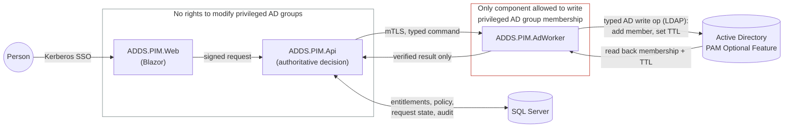

# Architecture

ADDS-PIM is built as a layered (clean/onion) .NET solution with a hard trust boundary drawn around the component that is allowed to touch privileged Active Directory groups. This page describes the components, why the boundaries between them sit where they do, and how a request flows end to end from a user's browser to a verified change in Active Directory.

## Components and boundaries

The solution consists of a Blazor frontend, a backend API, an application/domain core, infrastructure
adapters, versioned transport contracts, an isolated AD Worker, SQL Server, Active Directory, certificate management, and audit/monitoring. The Web frontend, the API, and the AD Worker are separate processes with separate technical identities - this is not just a code-organization convention, it is the actual security boundary.

The frontend renders requests, collects input, and drives the user interaction. The API orchestrates the
server-side decision and persists the request. Only the AD Worker is permitted to change privileged group memberships. SQL Server is authoritative for application entitlements, policies, request state, idempotency, and audit data; Active Directory is authoritative for the existence and effective state of users, groups, and memberships.

The system also separates three identity roles that are easy to conflate: the natural person, their
interactive actor account (the account they are logged in as), and the privileged target account whose group membership is being changed. SQL Server owns the mapping between these roles and the concrete entitlement; Active Directory remains authoritative for whether the accounts themselves exist and are enabled. No component is allowed to implicitly derive the target account from the logon account - the person must explicitly select which target account a request applies to, and the UI and confirmation step always show actor and target account separately. See [identity-and-lifecycle.md](identity-and-lifecycle.md) for how this plays out across a request's lifecycle.

Authorization decisions themselves - who may request what, under which conditions - are described in [security-model.md](security-model.md). The state machine a request moves through is described in [identity-and-lifecycle.md](identity-and-lifecycle.md). Whether a request is ultimately reported as successful depends solely on reading the change back from Active Directory and verifying it, not on the Worker's local belief that the operation succeeded - see [active-directory-worker.md](active-directory-worker.md).



The diagram shows the two trust boundaries the design hinges on. First, the Web and API processes -
however compromised the browser session or the API request path might be - hold no rights to change a privileged AD group directly; they can only ask the Worker. Second, the Worker never reports success based on its own belief that a write went through: it re-reads the group membership and its remaining TTL from Active Directory and only forwards a verified result back to the API. A request that is signed, authorized, and executed but fails that read-back is reported as failed, not successful.

### Component responsibilities

| Component | Responsible for | Explicitly not allowed to |
|---|---|---|
| `ADDS.PIM.Web` | Blazor UI, presentation, input, user interaction | Decide authorization or change Active Directory |
| `ADDS.PIM.Api` | REST endpoints, caller authentication, orchestration | Modify privileged AD groups directly |
| `ADDS.PIM.Application` | Use cases, workflow orchestration, ports (interfaces) | Contain infrastructure details or UI logic |
| `ADDS.PIM.Domain` | Entities, value objects, policies, state transitions, domain errors | Depend on ASP.NET, EF Core, or PowerShell types |
| `ADDS.PIM.Infrastructure` | SQL persistence, certificates, logging, external adapters | Define business rules |
| `ADDS.PIM.Contracts` | Explicit, versioned transport contracts | Expose domain aggregates or EF Core models |
| `ADDS.PIM.AdWorker` | Typed, privileged AD execution and read-back verification | Run general-purpose scripts or make business authorization decisions |
| `ADDS.PIM.Shared` | A small number of genuinely cross-cutting, domain-neutral primitives | Become a dumping ground for arbitrary shared code |

An installer/setup component (`ADDS.PIM.Setup`) is part of the intended architecture - responsible for prerequisite checks, installation, upgrade, and repair, without unsupervised changes to business data - but is not yet a distinct project in the current solution tree; today, installation is handled by PowerShell scripts alongside a plain SQL bootstrap script. See [operations.md](operations.md) for the current install/upgrade story.

The rights actually granted to each running identity (service accounts, group-managed service accounts, and so on) are defined in [security-model.md](security-model.md), not here - this page describes structural
boundaries, not the concrete ACLs.

## Why Web and API are separate processes with separate identities

The frontend needed to support Kerberos single sign-on on Windows/IIS while keeping the API authoritative for authentication and authorization. That ruled out any design where application signing keys would need to live in the browser.

The chosen approach is a Blazor Web App using interactive server-side rendering, hosted in IIS with Windows Authentication/Kerberos. `ADDS.PIM.Web` and `ADDS.PIM.Api` run as distinct components with distinct technical identities: the API authenticates the Web component as a technical caller, and does not treat frontend-supplied entitlement, TTL, security level, or authorization data as trustworthy - it re-validates everything against current server-side data immediately before executing anything. The Web component forwards the authenticated user's identity to the API only through a versioned, integrity-protected contract, which the API independently validates.

Application signing keys belong to the Web component's technical identity and stay in the Windows Certificate Store; browser-side JavaScript never has access to a private key. This signature protects the integrity of the request on its way to the API and is independent of end-user multi-factor authentication or transaction confirmation, which are separate controls (see [security-model.md](security-model.md)).

A Blazor WebAssembly frontend was considered and rejected for this stage of the project, because it would push application logic and signing into the browser and require an unresolved client-trust design. A traditional server-rendered MVC application was also considered and rejected simply because it doesn't use the chosen Blazor UI platform. The practical consequence is that  compromising the Web tier does not, by itself, grant any ability to modify Active Directory - that capability is deliberately kept out of reach of the browser-facing component. A future move to an OpenID Connect/SAML identity provider or a browser-hosted UI is possible but will be a deliberate, separately evaluated architecture change.

## Preferred solution structure

```text
ADDS-PIM.sln
├── src
│   ├── ADDS.PIM.Web
│   ├── ADDS.PIM.Api
│   ├── ADDS.PIM.Application
│   ├── ADDS.PIM.Domain
│   ├── ADDS.PIM.Infrastructure
│   ├── ADDS.PIM.Contracts
│   ├── ADDS.PIM.AdWorker
│   └── ADDS.PIM.Shared
├── tests
├── database
└── docs
```

Additional projects or layers need a clear, distinct purpose - the design deliberately avoids overengineering the solution structure beyond what the trust boundaries above require.

## The AD Worker and how it is reached

Only the AD Worker may modify privileged Active Directory memberships, which means the API and the Worker need a process boundary that supports distinct identities, typed commands, correlation, replay protection, and eventual multi-server deployment.

The Worker exposes a private HTTPS endpoint protected by mutual TLS. Commands sent to it are versioned contracts carrying a globally unique command ID, request ID, correlation ID, UTC timestamp, nonce, and a deterministic command hash; the Worker persists replay/idempotency information before it executes an allowed, strongly typed operation. AD membership execution itself sits behind an application-owned port (`ITemporaryGroupMembershipService`); neither the domain nor the application layer references LDAP types directly, so the concrete execution technology can evolve without touching business logic.

The Worker runs as a standalone ASP.NET Core/Kestrel Windows Service - it does not run inside IIS and does not share an application pool or runtime identity with the Web or API components. The API may run in IIS under its own service identity. In a single-host development or proof-of-concept setup the API and Worker may be co-located as separate Windows services with separate identities; a production deployment is expected to use a dedicated, domain-joined Worker host. "Private" means the Worker's HTTPS binding, host firewall, and network ACLs allow inbound connections only from explicitly listed API server addresses - no browser, end user, or general management network ever reaches the Worker endpoint directly, and the Worker validates the API's client certificate just as the API validates the Worker's server certificate. Worker commands are only accepted when their UTC issue time is not in the future and is no older than a configured maximum age (30–600 seconds, 300 by default) - a short freshness window layered on top of persistent, durable replay protection.

See [active-directory-worker.md](active-directory-worker.md) for how the Worker actually executes operations
against Active Directory and performs the read-back verification, and [security-model.md](security-model.md) for the least-privilege rights the Worker's service account is granted.

## Persistence

SQL Server holds durable request state, idempotency records, authorization policy data, and append-oriented audit records. Persistence uses Entity Framework Core against SQL Server with versioned migrations checked into source control, rather than hand-written SQL migrations (which would duplicate model-mapping work without a corresponding benefit) or in-memory persistence (which cannot satisfy request idempotency or audit-integrity requirements). Production connections use Windows Integrated Security under the owning component's service identity; SQL Server authentication with stored credentials is not the supported.

The domain layer deliberately has no dependency on EF Core - persistence mapping lives entirely in
`ADDS.PIM.Infrastructure`. Schema constraints enforce unique request and command IDs, UTC timestamps, foreign keys, and optimistic concurrency tokens. Audit events are append-oriented and are never updated in place; SQL Server Express is supported. See [data-model.md](data-model.md) for the schema itself and [audit-and-observability.md](audit-and-observability.md) for how audit records are structured and protected.

## End-to-end trust flow

1. An actor account authenticates to the frontend and is resolved server-side to exactly one active person.
2. Security-relevant API communication is protected by request signing (see [security-model.md](security-model.md)).
3. The person selects a target account that is explicitly linked to them; the UI and the confirmation step show the actor account and the target account separately, never merged.
4. The API validates the person, the actor account, the target account, the target group, and the entitlement against current server-side data.
5. An authenticated, integrity- and replay-protected internal command carrying the validated target-account identity is sent to the Worker.
6. The Worker executes only the specific, typed, allowed operation for that target account.
7. The result is read back from Active Directory, evaluated, persisted, and audited together with all of the identity roles involved.

## Known open items

Some architectural questions are intentionally left open rather than pre-decided, either because they don't block the current scope or because they need more real-world signal first:

- **Handling of explicit domain credentials**, where a workflow would require them, has no defined secure handling approach yet.
- **Multi-domain-controller and replication-delay strategy** for AD verification is unresolved beyond the current single-forest, single-environment scope; the verification approach for that scope is settled (see [active-directory-worker.md](active-directory-worker.md)), but behavior across multiple domain controllers
  or replication topologies is not.
- **High availability, multi-domain/multi-forest support, and Tier-0 isolation** are not yet designed.
- **A recovery / break-glass process** for operating the system when normal paths are unavailable is not yet defined.
- **Tamper-resistance mechanics for audit data**, including whether/how a Windows Event Log provider is used, remain open beyond the append-only, never-updated-in-place guarantee described in [audit-and-observability.md](audit-and-observability.md).
- **Forest-fingerprint verification, account provisioning, account transfer, and shared accounts** across multiple forests are out of scope for the current single-forest configuration and are not yet designed.
- **Installer technology** for setup/upgrade is not yet chosen; the persistence approach it will apply
  (EF Core migrations) is settled, but the installer mechanism itself is not.

Until each of these is settled, any related code sticks to an architecture-neutral abstraction rather than
committing to a specific mechanism - the goal is to avoid load-bearing decisions being made implicitly through code before they've been thought through deliberately.
