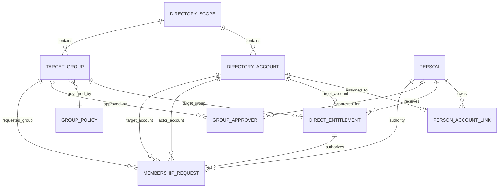

# Data Model

This page describes the schema that backs ADDS-PIM's authorization decisions, request history, and audit trail: the core entities, why SQL Server - not Active Directory - is authoritative for entitlements, policies, request state, and idempotency, the migration approach, and the durable outbox pattern used for completion-event delivery.

For the domain concepts these tables implement (person, actor account, target account, request lifecycle), see [identity-and-lifecycle.md](identity-and-lifecycle.md). For the authorization decision itself, see [security-model.md](security-model.md). For the append-only audit record schema specifically, see [audit-and-observability.md](audit-and-observability.md) - audit fields are not duplicated here. For actually running migrations and installing the database, see [operations.md](operations.md).

## Why SQL Server is authoritative here, and AD is authoritative elsewhere

ADDS-PIM deliberately splits authority between two systems rather than treating either one as a single source of truth for everything:

**SQL Server is authoritative** for application entitlements, group policies, request state, idempotency records, and audit facts. These are things Active Directory has no native concept of - AD does not know which person is entitled to request which group for which target account, does not track a request's workflow state, and does not provide durable, queryable, append-only audit history.
**Active Directory remains authoritative** for the existence and effective state of users, groups, and memberships. ADDS-PIM never assumes a cached SQL row still reflects reality - a person, account, or group can be disabled, deleted, or renamed in AD independently of anything stored here.

This split has direct schema consequences. Every AD-backed row (accounts, target groups) stores its AD object's stable identity - directory scope plus `objectGUID` - rather than treating a mutable attribute like `sAMAccountName`, user principal name, distinguished name, or display name as a key. Those mutable attributes are stored too, but only as the most recently verified snapshot, refreshed from AD, never as the join key between SQL rows. If an AD object is deleted and a new object is created under the same name, its different `objectGUID` produces a different account or group in SQL with no inherited link, mapping, or entitlement from the deleted object. Every account and target group row also carries `IsEnabledInDirectory` / `IsWithinAllowedScope` and a `LastVerifiedUtc` timestamp - the last-known AD state, not a live one - and the authorization decision re-verifies against current AD data immediately before execution rather than trusting the cached flag alone.

## Core entity relationships

Authorization is not a simple person-to-group or account-to-group link. A direct entitlement always applies to a specific triple:

```text
Person + Target Account + Target Group
```



## Entities

### DirectoryScope

`DirectoryScope` is the namespace within which an `objectGUID` resolves uniquely. The current deployment model operates with exactly one configured Active Directory forest, but every AD-backed row still stores its scope explicitly, so a future multi-forest configuration doesn't require retrofitting every table.

| Field | Meaning |
|---|---|
| `DirectoryScopeId` | Internal, immutable primary key |
| `StableScopeIdentifier` | Forest reference determined and verified during setup |
| `DisplayName` | Non-authoritative display name |
| `IsActive` | A deactivated scope permits no new authorization |
| `CreatedUtc`, `ModifiedUtc` | UTC management timestamps |
| `RowVersion` | Optimistic concurrency token |

A different forest gets a new `DirectoryScopeId`. Existing objects are never moved between scopes by name comparison. The exact setup-time forest-fingerprint verification mechanism is an open item.

### Person

`Person` is the stable business subject of the application - not an AD login.

| Field | Meaning |
|---|---|
| `PersonId` | Internal, immutable primary key |
| `DisplayName` | Display name only; not an authorization identity |
| `ExternalReference` | Optional reference to a future HR/IAM system |
| `NotificationEmailOverride` | Optional email address for outcome notifications addressed to this person, taking precedence over their AD account's email whenever set (see [Mail notifications](#mail-notifications) below) |
| `IsActive` | An inactive person may not create new requests |
| `ValidFromUtc`, `ValidUntilUtc` | Business validity window |
| `CreatedUtc`, `ModifiedUtc` | UTC management timestamps |
| `RowVersion` | Optimistic concurrency token |

The authority and provenance of an external personnel reference depends on a provisioning integration that is not yet decided; until then it must not be used for sign-in or authorization.

### DirectoryAccount

`DirectoryAccount` represents a concrete AD user object. Its stable authorization identity is `(DirectoryScopeId, ObjectGuid)`.

| Field | Meaning |
|---|---|
| `AccountId` | Internal primary key and reference throughout the application model |
| `DirectoryScopeId` | Directory scope the account belongs to |
| `ObjectGuid` | Stable AD object identity within the scope |
| `ObjectSid` | Current, verified attribute snapshot - never used alone as a key |
| `SamAccountName`, `UserPrincipalName`, `EmailAddress` | Mutable login/contact attributes, refreshed from AD |
| `DistinguishedName`, `DomainQualifiedName`, `DisplayName` | Mutable lookup and display attributes |
| `IsEnabledInDirectory` | Last-verified AD enabled/disabled state |
| `IsWithinAllowedScope` | Last-verified scope evaluation |
| `LastVerifiedUtc` | Timestamp of the last AD verification |
| `IsActive` | Administrative application-level enablement |
| `CreatedUtc`, `ModifiedUtc`, `RowVersion` | Management and concurrency |

UPN, `sAMAccountName`, distinguished name, and display name are never authorization keys. If an AD object is deleted and re-created under the same name, its different `objectGUID` produces a different account with no inherited link or entitlement.

### PersonAccountLink

`PersonAccountLink` connects a person to an account for one or both explicit purposes.

| Field | Meaning |
|---|---|
| `PersonAccountLinkId` | Primary key |
| `PersonId`, `AccountId` | The explicit link |
| `MayAuthenticate` | This account may interactively represent the person (sign in) |
| `MayReceivePrivileges` | This account may be the target of a TTL-limited membership |
| `MayApprove` | This account's person may approve requests for groups they're assigned as an approver on - only meaningful together with `MayAuthenticate`, since approving happens through an interactive sign-in |
| `IsActive` | Whether the link is currently usable |
| `ValidFromUtc`, `ValidUntilUtc` | Validity window |
| `CreatedBy`, `ModifiedBy` | Administrative actors |
| `CreatedUtc`, `ModifiedUtc`, `RowVersion` | Management and concurrency |

A person can own several accounts. A normal account belongs to at most one person over its entire supported lifetime; shared accounts, account transfer between people, and multiple ownership are not supported without a new architecture decision. An active link must set at least one purpose. Changes and deactivations are audited. SQL enforces, through a filtered unique index, that at most one active link per person may set `MayAuthenticate` - inactive history does not block a replacement account from taking over that role.

Example:

| Person | Account | `MayAuthenticate` | `MayReceivePrivileges` |
|---|---|---:|---:|
| Jane Doe | `EXAMPLE\jdoe` | yes | no |
| Jane Doe | `EXAMPLE\jdoe-admin` | no | yes |
| Jane Doe | `EXAMPLE\jdoe-tier0` | no | yes |

### TargetGroup and GroupPolicy

`TargetGroup` represents a concrete AD group that has been explicitly enabled for ADDS-PIM. Its stable identity is also `(DirectoryScopeId, ObjectGuid)`.

| Field | Meaning |
|---|---|
| `TargetGroupId` | Internal primary key |
| `DirectoryScopeId`, `ObjectGuid` | Stable AD object identity |
| `ObjectSid` | Current verified attribute - never used alone as a key |
| `SamAccountName`, `DistinguishedName`, `DomainQualifiedName`, `DisplayName` | Mutable attributes |
| `GroupPolicyId` | The currently applicable, data-driven policy |
| `IsEnabledForRequests` | Explicit allow-list flag |
| `GroupPolicy.IsActive` | An inactive policy behaves as if the group weren't enabled for requests, without deleting its historical configuration |
| `IsWithinAllowedScope`, `LastVerifiedUtc` | Current verification state |
| `CreatedUtc`, `ModifiedUtc`, `RowVersion` | Management and concurrency |

Existing in AD is not sufficient by itself - only active, explicitly enabled, and currently in-scope-verified groups can be requested.

`GroupPolicy` contains or references the minimum, maximum, and default TTL, allowed time increments, required security level and factors, and ticket/approval requirements for a group. None of this is hard-coded from a group's name (a group literally named "Tier 0" carries no special built-in behavior - its policy row is what determines its rules). `AllowedSecondFactorTypes` is an explicit set drawn from `Fido2` and `Totp`; if `RequiresSecondFactor` is set, the set must contain at least one of them.

Ticket-pattern requirements and the approval workflow are both implemented, but neither is turned on for the example policies below - an administrator enables them per target-group policy in the admin UI. Enabling approval additionally requires assigning at least one active approver to the group, otherwise every affected request stays stuck in the awaiting-approval state indefinitely.

### GroupApprover

`GroupApprover` is the table that records who is allowed to approve requests for a given target group - the assignment referenced above.

| Field | Meaning |
|---|---|
| `GroupApproverId` | Primary key |
| `TargetGroupId` | The group this person may approve requests for |
| `PersonId` | The approving person |
| `IsActive` | Whether this approver assignment currently applies |
| `NotifyByEmail` | Whether this approver receives the approval-pending/approval-decision emails (see [Mail notifications](#mail-notifications) below); defaults to `true` |
| `ValidFromUtc`, `ValidUntilUtc` | Validity window |
| `CreatedBy`, `ModifiedBy` | Administrative actors |

A person only actually functions as an approver at decision time if they also hold an active `PersonAccountLink` with `MayApprove` set (see above) - assigning someone as a `GroupApprover` without a `MayApprove`-enabled account link leaves them unable to approve anything. Any one of a group's active approvers can approve or reject a request; the first decision wins, and self-approval is not specially excluded (see [identity-and-lifecycle.md](identity-and-lifecycle.md) for the full approval workflow).

Example group policies as currently configured:

| Group | Min TTL | Default TTL | Increment | MFA required | Allowed factors | Ticket required | Approval required |
|---|---:|---:|---:|---|---|---|---|
| Operators | 30 min | 1 hour | 30 min | no | none | no | no |
| Admins | 30 min | 1 hour | 30 min | yes | FIDO2 or TOTP | no | no |
| Tier0 | 30 min | 1 hour | 30 min | yes | FIDO2 or TOTP | no | no |

These are example values for a specific deployment, not application-defined semantics - minimum, default, increment, required security level, and ticket/approval requirements are all set per group at setup time.

### DirectEntitlement

`DirectEntitlement` is the concrete business-level grant.

| Field | Meaning |
|---|---|
| `EntitlementId` | Primary key |
| `PersonId` | The responsible, authorized person |
| `TargetAccountId` | The single privileged target account this entitlement applies to |
| `TargetGroupId` | The single target group this entitlement applies to |
| `IsActive` | Whether the entitlement is currently usable |
| `ValidFromUtc`, `ValidUntilUtc` | Validity window |
| Policy/constraint fields | TTL, time increments, security level, factor, ticket and approval requirements per the authorization model |
| `CreatedBy`, `ModifiedBy` | Administrative actors |
| `CreatedUtc`, `ModifiedUtc`, `RowVersion` | Management and concurrency |

Entitlement-specific constraints are checked together with the target group's current policy; an entitlement may only narrow the group policy, never widen it. There can never be more than one simultaneously active entitlement for the same `(PersonId, TargetAccountId, TargetGroupId)` tuple.

An entitlement granted for, say, `Jane Doe + EXAMPLE\jdoe-tier0 + EXAMPLE\Domain Admins` does not apply to any other account belonging to the same person. In particular, two simplified models are explicitly rejected as insufficiently precise:

```text
PersonGroup(PersonId, TargetGroupId)
AccountGroup(AccountId, TargetGroupId)
```

The first would be too broad - it would apply across all of a person's target accounts. The second loses the responsible person and drops the check against the authenticated actor account.

Creating a direct entitlement is restricted to currently active, in-scope, privilege-receiving person/account links and registered target groups, and uses a serializable transaction to reject concurrent overlapping entitlement windows for the same person/account/group tuple. For a given tuple, the administrative create operation first rejects an existing active overlapping entitlement; if a matching inactive entitlement exists and no active overlap exists, it reactivates the most recently changed inactive row and applies the new validity window rather than creating a duplicate row; otherwise it creates a new row. This keeps a single, traceable entitlement lifecycle per tuple instead of accumulating duplicate active grants. Updates use `RowVersion` and append audit events; entitlement TTL constraints may narrow but never widen the current target-group policy.

### MembershipRequest and historical identity

Every request immutably references at least:

| Field | Meaning |
|---|---|
| `PersonId` | The person on whose authority the request is made |
| `ActorAccountId` | The account actually authenticated for this request |
| `TargetAccountId` | The explicitly selected privileged target account |
| `TargetGroupId` | The requested group |
| `EntitlementId` | The direct entitlement used in the decision |

The request additionally stores display-name snapshots for the person, actor account, target account, and target group. Snapshots stay readable after later renames, but they never substitute for current SQL authorization or AD verification. Even when the actor account and target account are the same AD object, both roles are stored and checked separately.

The authorization lookup, in order:

1. The authenticated AD object is resolved as the actor account by scope and `objectGUID`.
2. Exactly one active link with `MayAuthenticate` set determines the active person.
3. The chosen target account has an active link with `MayReceivePrivileges` set, to the same person.
4. An active, time-valid entitlement matches `(PersonId, TargetAccountId, TargetGroupId)` exactly.
5. Entitlement constraints and the current group policy allow the request.
6. Active Directory confirms existence, uniqueness, scope, and state of the objects involved.
7. Immediately before execution, the full decision is repeated against current data.

Any missing, ambiguous, inactive, expired, stale, or unverifiable piece of information leads to a deny-by-default rejection. See [security-model.md](security-model.md) for the full authorization decision and [identity-and-lifecycle.md](identity-and-lifecycle.md) for the request state machine that governs a request after this decision is made.

### DirectoryReconciliationRun and DirectoryReconciliationFinding

`DirectoryReconciliationRun` records an administrator-started, single-flight maintenance run against one configured directory scope. `DirectoryReconciliationFinding` retains positive, `objectGUID`-based findings about accounts or target groups - each with its detection reason, a display-name snapshot, detection time, lifecycle status, and (if reviewed) the deactivating administrator and time, plus a row version.

Runs and findings are operational review data - they support an administrator's decision, but they are neither an authorization input nor an audit fact by themselves. A failed AD query never produces an absence finding (silence about an object is not evidence it's gone). When an administrator reviews and acts on a finding, that action resolves the finding and transactionally deactivates the referenced local account or group along with its dependent authorization records; a separate append-only audit event records the administrative action itself.

### PurgeEventOutbox

`PurgeEventOutbox` retains a post-commit Windows Event Log completion obligation until it has actually been delivered.

An identity purge needs two independent evidence trails: an immutable SQL audit fact and a correlated Windows Event Log record. The database delete and the SQL audit fact can share one transaction; a Windows Event Log write cannot participate in that same transaction, and Windows Event Log offers no supported, recoverable two-phase participant for this purpose. Writing the completion event as a simple best-effort step after commit was rejected, because a process crash between commit and that write would silently lose a required piece of evidence - and treating a background log write as proof of purge success was considered actively misleading.

The chosen design writes a mandatory Event Log intent *before* any deletion happens - if that write fails, no transaction starts and no data is deleted. In the same SQL transaction as the immutable audit fact and the actual deletion, a completion-delivery record is persisted to `PurgeEventOutbox`. A protected background dispatcher then delivers the completion Event Log event after commit and retries until delivery succeeds, using the outbox row's own ID as the Event Log idempotency key - so a crash between writing the event and marking it delivered can produce a duplicate Event Log record, but both copies carry the same outbox ID and are meant to be interpreted as a single completion fact by anything consuming them (including a SIEM).

Minimum fields: an outbox ID, event ID/type, correlation ID, a canonical structured payload, created UTC, delivery-attempt count, last-attempt UTC, delivered UTC, a protected last-failure category, and a row version. Entries are not authorization data, and they are not deleted as part of the identity-purge graph itself - their retention is a separate, not-yet-decided operational policy; until that's decided they are kept indefinitely. A pending (undelivered) outbox row is a visible operational recovery condition for the team running the system, but it does not block unrelated membership workflows and does not turn the application into a high-availability logging subsystem in its own right.

As of this writing, the API exposes only a server-computed, read-only purge-scope preview; no destructive purge command has been exposed yet, so this table exists and is exercised in tests ahead of the destructive endpoint that will populate it in production use.

### Mail notifications

Four tables back ADDS-PIM's outbound email, all reusing the same post-commit outbox pattern as `PurgeEventOutbox` above rather than a second, divergent design: an event's enqueue and the state change that caused it commit together in one transaction, and a separate background dispatcher delivers the queued email afterward with its own retry/backoff. See [Outbound email and notifications](operations.md#4-outbound-email-and-notifications) in `operations.md` for the administrative side of configuring all of this.

`MailSettings` is a single-row table holding the outbound SMTP host, port, sender address, optional username, an optionally encrypted password, and TLS mode. The password, if set, is encrypted at rest with the same certificate-backed protector used for TOTP secrets, and is never returned to the admin UI once saved.

`GroupNotificationRecipients` holds zero or more email addresses per target group, each flagged as a `To`, `Cc`, or `Bcc` recipient. `NotificationTemplates` is keyed by a template key rather than being a singleton, so each of the four notification types below (membership-request outcome, requester outcome, approval pending, approval decided) has its own admin-editable Subject/Body pair without further schema changes as more types are added; the body may reference a fixed set of `{Placeholder}` tokens replaced by literal substitution, not a general templating engine. `RequesterNotificationSettings` is a second single-row table holding a global Cc/Bcc applied to every requester-outcome email specifically - deliberately separate from `MailSettings`, since one is SMTP transport configuration and the other is recipient-side policy for a single notification type.

`MailNotificationOutbox` is the delivery queue itself: an immutable, already-rendered Subject/Body (editing a template later never changes an already-queued message), a request ID, per-header `To`/`Cc`/`Bcc` address lists, delivery-attempt bookkeeping, and a row version. A membership request reaching a terminal state can enqueue up to two rows here (group recipients, requester), and a request entering or leaving `AwaitingApproval` can enqueue a third (pending approvers, or the other approvers once one of them decides) - all in the same transaction as the underlying state transition. Each notification type is inert - nothing is enqueued - until both its recipients/opt-in and its template exist; there is no separate feature-wide enable flag.

## Integrity rules enforced by the schema

Beyond individual entity constraints, the database enforces schema-level rules that no in-memory check or UI filter is treated as sufficient to replace:

- Unique AD object identities via `(DirectoryScopeId, ObjectGuid)` for both directory accounts and target groups.
- At most one person mapping over the supported lifetime of a normal directory account.
- At least one purpose (`MayAuthenticate` or `MayReceivePrivileges`) set on an active person/account link.
- Foreign keys from direct entitlements to a person, a concrete target account, and a concrete target group - an entitlement can never exist without a specific target account.
- No two simultaneously active entitlements for the same person/target-account/target-group tuple.
- `Restrict` instead of cascading delete for any row still referenced by history or authorization-relevant data.
- `rowversion` optimistic-concurrency tokens on mutable person, account, link, group, policy, and entitlement data.
- UTC validity intervals with `ValidUntilUtc > ValidFromUtc` wherever an end is set.

Temporal overlaps that a unique index alone cannot rule out are checked inside a transactional application operation, on top of unique, foreign-key, and check constraints in the database itself - an in-memory check or UI-level filter is explicitly not considered sufficient on its own.

People, accounts, links, target groups, policies, and entitlements are deactivated or time-bounded for new decisions rather than deleted. Physical deletion is not permitted while a request, status history entry, or audit event still references the row - doing so would make an audit or request record ambiguous. Display-name snapshots stored in requests and audit events are append-oriented historical facts and are never updated to reflect a later rename.

Soft delete is only used where history is preserved and authorization cannot become ambiguous as a result. Audit facts are strictly append-oriented and are never overwritten after the fact; hash-chaining, batch signing, write-only database rights, partitioning, and formal retention rules would each need their own documented design and tests before adoption - see [audit-and-observability.md](audit-and-observability.md) for the current state of that guarantee.

Worker replay records (`WorkerCommands`) are conceptually a separate cleanup concern from identity purges - once the Worker's replay/freshness window has elapsed, these technical replay rows no longer need to be kept for correctness. No scheduled cleanup job for `WorkerCommands` exists yet, though; the table currently grows without a retention policy, which is a known gap rather than an implemented behavior. Whatever cleanup gets built for it should never touch business audit facts, which are governed by a separate, much stricter retention story (see [audit-and-observability.md](audit-and-observability.md)).

## Migrations

Persistence uses Microsoft Entity Framework Core against SQL Server, with versioned migration files checked into source control, rather than hand-written SQL migrations (which would duplicate EF's model-mapping work without a corresponding benefit for this project) or in-memory persistence for an early slice (which cannot satisfy request idempotency or audit-integrity requirements at all). Production connections use Windows Integrated Security under the owning component's service identity; SQL Server authentication with stored credentials is not supported by default. SQL Server Express is supported for development only.

The domain layer deliberately has no dependency on EF Core - persistence mapping lives entirely in the infrastructure layer, and Contracts/API responses never expose EF Core entities directly. Schema constraints enforce unique request and command IDs, UTC timestamps, foreign keys, and optimistic concurrency tokens. Migrations are generated, reviewed, and tested alongside each schema change; setup applies them using an explicitly authorized deployment identity. See [operations.md](operations.md) for how migrations are actually run during install and upgrade, and a plain SQL bootstrap script that can stand in for running the full migration pipeline.

An earlier prototype slice persisted only a generic `SubjectId` on each request. A later migration replaced that prototype with the explicit, immutable person/actor-account/target-account/target-group references and snapshots described above, and was written to fail rather than guess if any old prototype request or audit data was still present - it never silently assigns historical data to a person or account it can't verify. Data that cannot be unambiguously migrated is rejected or quarantined, never guessed at. This same principle - fail rather than silently reinterpret old data - is expected to apply to future schema slices (executions, active memberships, authentication factors, signing certificates, worker nodes, health events) as they are added; transport contracts never expose persistence models directly regardless of how the underlying schema evolves.
