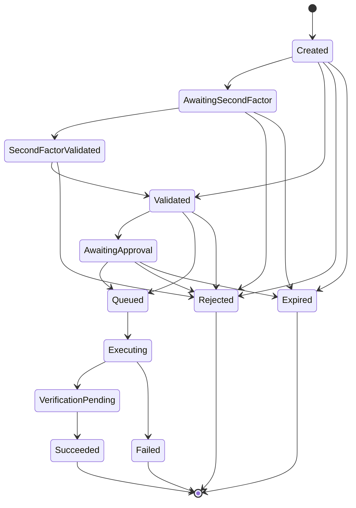

# Identity and Request Lifecycle

This page describes how ADDS-PIM models identity - the person requesting access, the account they authenticated with, and the account that actually receives a privileged group membership - and how a membership request moves from creation to a verified, time-limited grant (or a denial). It is written for architects, security governance reviewers, and Active Directory operations staff who need to understand what state a request can be in, what triggers a transition, and why the model separates concepts that many simpler tools collapse together.

For the authorization decision itself (who is allowed to request what), see [security-model.md](security-model.md). For how the Active Directory write and TTL verification actually happen, see [active-directory-worker.md](active-directory-worker.md). For the underlying schema, see [data-model.md](data-model.md).

## 1. Person, actor account, and target account

A single human being can sign in to ADDS-PIM with one Active Directory account and need a temporary privileged group membership on a *different* account. This is a common pattern in environments that separate everyday, interactive logon accounts from administrative accounts: for example, `EXAMPLE\alice` might be the account someone uses to log into their workstation and sign in to ADDS-PIM, while `EXAMPLE\alice-adm` is a separate, non-interactive account that is a member of privileged groups such as Domain Admins.

If a system simply granted privileges to whichever account happened to authenticate, it would be structurally unable to represent this separation - and worse, it would risk granting privileges to the wrong security principal, and would leave authorization and audit records ambiguous about which account actually gained access. ADDS-PIM avoids this by modeling three distinct roles explicitly, every time:

- **Person** - a stable, application-level identity representing the human being on whose authority a request is made. A person is not itself an AD login; it is ADDS-PIM's own durable subject.
- **Actor account** - the AD account the person authenticated the current session with.
- **Target account** - the AD account that will actually receive the temporary group membership, chosen explicitly by the requester (or implied by their entitlement) rather than defaulted from whatever account they logged in with.

Every membership request immutably records all three identities, plus the target group, at the moment the request is made. Later changes to how accounts are linked to a person do not rewrite this historical record - what a request says happened is what happened. Immediately before execution, however, the system re-checks the *currently active* account associations and the concrete entitlement again, so a link that has since been revoked or changed cannot be used to smuggle through a stale authorization.

A directory account can be enabled for interactive sign-in, for use as a privilege target, or both, through an explicit, purpose-aware link between a person and an AD account. A normal account belongs to at most one person. Critically, an entitlement is never granted to "this person, for any account they happen to control" - it authorizes one specific, concrete combination of person, target account, and target group. Granting someone a group entitlement does not implicitly extend that entitlement to every AD account linked to them, and the same account may serve as both actor and target only when the entitlement explicitly allows exactly that combination. The worker command that eventually performs the AD write always carries the already-validated target account identity; it never derives that identity from whoever happens to be calling the API.

This separation also protects against a subtler problem: Active Directory account names, user principal names, and distinguished names can all change, and an account can be deleted and a new one created under the same display name. ADDS-PIM's identity and entitlement model (below) is built specifically so that renaming or recreating an account does not silently inherit an old authorization.

## 2. How AD accounts and groups are identified and scoped

### Directory scope and stable object identity

Rather than trusting mutable, human-readable AD attributes as authorization keys, ADDS-PIM identifies every AD object - accounts and managed groups alike - by the pair `(DirectoryScopeId, ObjectGuid)`. `objectGUID` is the one AD attribute that stays stable across renames; the `DirectoryScopeId` namespaces that GUID to one specific, administrator-provisioned Active Directory forest/domain configuration.

SID, user principal name, `sAMAccountName`, distinguished name, and display name are treated purely as current directory attributes (or historical snapshots kept for readability), never as authorization keys. The API and the AD Worker always re-resolve and re-verify the expected object before acting. If an account is deleted and a new one is created later with the same name, that new object gets a new `objectGUID` and inherits nothing - no links, no entitlements - from the old one.

An installation is configured against exactly one directory scope at a time, recorded in protected runtime configuration together with the domain and forest DNS names. Repointing an installation at a different forest is treated as a deliberate, disruptive administrative act: it requires provisioning a brand-new scope ID and re-registering every account, group, link, and entitlement from scratch. Nothing is silently rebound by matching names across scopes, and the current model does not attempt to cryptographically fingerprint the forest to detect a covert forest swap - an administrator changing the configured domain or forest is expected to treat that as a security-relevant change in its own right.

### The relational identity and entitlement model

On top of that stable object identity, the authorization data model consists of:

- **Person** - the stable application subject (see above).
- **DirectoryAccount** - a concrete AD user object, identified by its scope and `objectGUID`.
- **PersonAccountLink** - a purpose-aware association between a person and a directory account, independently flagging whether the account may be used for interactive sign-in and/or as a privilege target (a related approver flag is described in section 5).
- **TargetGroup** - an AD security group that has been explicitly registered and enabled for use with ADDS-PIM.
- **GroupPolicy** - the current, data-driven policy attached to a target group (TTL limits, whether a ticket is required, whether approval is required, and so on).
- **DirectEntitlement** - authorizes exactly one tuple of person, target account, and target group, for a bounded validity interval.

An entitlement can only narrow what the target group's policy already allows (shorter TTL, additional requirements) - it can never widen it. Both the entitlement's own constraints and the group's current policy are re-checked immediately before execution, not just at the time the request was first validated.

### Managed target groups are an explicit allowlist

AD group existence alone does not make a group requestable. Administrators register target groups deliberately, one at a time: the API offers a read-only, bounded search over the configured writable domain controller (by display name or `sAMAccountName`), the administrator picks one match, and the API re-resolves that specific group by its GUID and verifies its object class and directory scope before persisting it together with an explicit policy. Neither the Web UI nor the API is ever permitted to create, rename, or delete an AD group - that boundary is deliberately kept as narrow as the boundary around privileged group *membership* writes, which belongs to the AD Worker alone (see [active-directory-worker.md](active-directory-worker.md)).

Retiring a target group disables it for new requests and deactivates its policy without physically deleting it - existing entitlements, historical requests, and audit records keep their reference to it. Reactivating a retired group is a separate, deliberate action that re-verifies the group against AD again rather than simply flipping a flag.

### Onboarding a person and their accounts

A person is not created from a free-text name. Onboarding starts with a bounded, server-side AD search that only returns accounts which are (transitively) members of the AD group configured as the ADDS-PIM user population. If the search returns more than one match, an administrator must deliberately pick exactly one; the API then re-resolves that account's `objectGUID` and re-verifies its object class, scope, and group membership immediately before saving anything. Onboarding creates the person record with an AD-derived display name, stores the verified directory account, and creates an active link that permits interactive sign-in but does *not* by itself permit that account to receive privileges. Additional or privileged target accounts are linked later through a separate account-management flow, since target accounts frequently are not - and don't need to be - members of the interactive user population.

## 3. Membership request lifecycle and state machine

A membership request carries a globally unique request ID and an end-to-end correlation ID from the moment it is created. It moves through capture, an optional second authentication factor, technical and business validation, an optional approval step, worker execution, an AD read-back verification, and a terminal outcome.

### States

| State | Meaning |
|---|---|
| `Created` | The request has been persisted. |
| `AwaitingSecondFactor` | Policy requires a specific second factor and it has not yet been confirmed. |
| `SecondFactorValidated` | The required second factor has been confirmed for this request. |
| `Validated` | Technical and business pre-checks succeeded. |
| `AwaitingApproval` | Policy requires human approval; the request is waiting on a decision from an approver assigned to the target group. |
| `Queued` | Execution has been durably scheduled. |
| `Executing` | The worker operation is running, or its outcome is being reconstructed after an interruption. |
| `VerificationPending` | Entered once the AD write and its read-back verification have already both succeeded, immediately before the request is marked `Succeeded` - today this is a momentary bookkeeping state on the success path, not a window where a request can sit while verification is still running or can be observed to fail from. |
| `Succeeded` | The time-limited membership has been positively verified in Active Directory. |
| `Rejected` | The request was permanently denied before execution (including an approver's rejection). |
| `Failed` | Execution or verification ended in a permanent failure. |
| `Expired` | The request, or a required confirmation, timed out. |

The domain model also defines a `Cancelled` terminal state and its transition guards allow reaching it from any non-terminal state, but nothing in the application today - no API endpoint, no UI action, no automated cleanup - actually transitions a request there. Treat it as reserved for a future explicit-withdrawal feature rather than a state you'll currently observe.

### Normal paths and transition rules



The two normal end-to-end paths are:

```text
Created -> AwaitingSecondFactor -> SecondFactorValidated -> Validated -> [AwaitingApproval ->] Queued -> Executing -> VerificationPending -> Succeeded
Created -> Validated -> [AwaitingApproval ->] Queued -> Executing -> VerificationPending -> Succeeded
```

Several non-terminal states can move to `Rejected` or `Expired` when there is a specific, applicable reason to do so - every such transition is explicitly allowed by the state machine and persisted with that reason. `Failed` today is reached only from `Executing`, when the worker operation or its verification does not end in a positive, TTL-verified outcome - not from earlier states, since nothing about execution has been attempted yet at that point. Terminal states are never overwritten retroactively: a person who wants to try again submits a new request (or the system follows an explicitly defined retry of the same request identity), rather than a terminal request being reopened.

`AwaitingApproval` is only entered when authorization, freshly re-evaluated immediately before the request would otherwise be queued, determines that approval is required (see section 5). A rejection by an assigned approver routes the request to the existing `Rejected` terminal state, tagged with a specific failure category so the audit trail distinguishes an approver's rejection from other kinds of denial - there is no separate terminal state just for approver rejections. An `AwaitingApproval` (or `AwaitingSecondFactor`) request that is administratively cleaned up after sitting unused past a reasonable window moves to `Expired`.

`Succeeded` is reachable only after a positive TTL read-back verification against Active Directory - see [active-directory-worker.md](active-directory-worker.md) for exactly what that verification checks. A request is never marked successful merely because the AD write call returned without an error.

### Persistence and traceability of transitions

Every transition is recorded transactionally with a UTC timestamp, the acting actor or component, a reason, the previous and new state, and an optimistic-concurrency token. A retry always re-reads the current persisted state first rather than assuming its own view is still accurate. If the API or worker process crashes mid-flight, the persisted history is designed to make the true situation reconstructible - whether an AD operation never started, is still running, may have completed, or still needs verification - so an unclear outcome is never quietly treated as a success.

The actor recorded against a transition is normally the requesting person themselves. Two kinds of transitions are attributed differently: an administrator cleaning up an orphaned `AwaitingSecondFactor` or `AwaitingApproval` request whose window expired unused, and an approver's decision on an `AwaitingApproval` request. Both record the acting administrator or approver as the actor instead. In both cases, the optimistic-concurrency token prevents that cleanup or decision from silently clobbering a confirmation that genuinely completed at the same moment - both paths require the same expected starting state, so only one of them can win.

## 4. Concurrency and idempotency

Because the same request can be triggered more than once - a double click, a browser refresh, a network or API retry, a retry from the worker side, multiple API instances handling traffic concurrently, or an outright replay of a captured request - the system is built to prevent duplicate execution rather than merely discourage it.

Both the membership request ID and the worker command ID are globally unique, and their uniqueness and replay protection are enforced persistently at the database level, not just by an in-process lock that a second instance or a restarted process could simply not know about. Before retrying anything, the system reads the request's current state as defined by the state machine above; state changes always go through a transaction combined with optimistic concurrency, so two concurrent attempts to move the same request cannot both "win" silently. Bounded retries distinguish transient failures (worth retrying) from permanent ones (worth failing fast) - see [operations.md](operations.md) for the operational error handling model.

The practical consequence for troubleshooting is that the persisted transition history for a request should always let an operator answer "did the AD operation ever run, and did it succeed?" even after a crash - an ambiguous outcome is deliberately never collapsed into "succeeded."

## 5. Approval workflow

A target group's policy - or a narrowing direct entitlement - can require that a request be approved by a human before it executes. The approval capability is modeled as a right on the person, expressed through the same account they already sign into ADDS-PIM with, not through a separate or privileged account: an approver's authority to approve is only ever granted on the same account link that already permits interactive sign-in for that person. This is the deliberate mirror image of how privilege-target accounts work - a target account is intentionally allowed to be a *different* account than the one used to sign in, because that separation is the point of the person/actor/target model in section 1, whereas approving is a decision made by an authenticated human and is tied to the account making that decision. Because a person can only have one active sign-in-enabled account link at a time, this automatically limits a person to at most one approval-capable account, with no extra uniqueness rule required.

A target group can have zero, one, or several assigned approvers. The assignment is a durable fact about the person, not about a specific account link, so it survives if the person's authenticating account is later changed. The concrete AD account used to represent an approver's decision is still re-resolved from the person's currently active approval-capable link at the moment of the decision - exactly as the system re-resolves a requester's currently active links rather than trusting an earlier snapshot.

Approval follows an any-one-of-many model: whichever assigned approver acts first - approving or rejecting - resolves the request. There is no quorum or unanimous requirement; this keeps the workflow a single, atomic state transition instead of a multi-party vote. Approvers are explicitly permitted to approve or reject their own requests, including in the common case of a single approver assigned to a small group - requiring a second, distinct approver would leave such groups unable to process their own members' requests at all. This is a conscious trade-off against a stricter separation-of-duties ideal, and it is fully mitigated by audit: every approval and rejection is attributed to the specific approver's identity, so governance reviewers can see exactly who decided what, including self-approvals, and adjust a group's approver assignments if that trade-off turns out to be too permissive for a particular group.

Both the requirement for approval and the specific approver's authorization for that target group are re-evaluated immediately before the approval decision takes effect - a stale list view, a since-revoked approver assignment, or a deactivated approval right cannot be exploited by acting on outdated information.

`AwaitingApproval` requests do not expire automatically on a timer. An administrator runs an explicit cleanup action that lists stale `AwaitingApproval` requests and expires selected ones deliberately - the same pattern used for orphaned second-factor confirmations. This keeps a human in control of what "stale" means for a low-volume, human-paced workflow rather than introducing a background service with an arbitrary fixed timeout. Administrators are expected to assign at least one active approver to a group before turning on its approval requirement; otherwise requests will pile up in `AwaitingApproval` until someone is assigned and either approves them or an administrator expires them.

## 6. Ticket-reference validation

A target group's policy - or a narrowing entitlement - can require that a membership request carry a ticket reference (for example a change or incident number such as `CHG-12345`), so that the reason for a temporary privilege grant is traceable in the audit record. A non-empty text field on its own is not treated as sufficient: the API enforces the requirement and validates the *shape* of the submitted value before the request can be persisted or dispatched, and repeats that validation again immediately before the request is handed to the worker.

Rather than hard-coding one ticket-system's format, administrators configure one or more named patterns - each with a label and a regular expression - attached to a target group's policy. The value kept with the request and its audit context is exactly what the requester typed, unmodified; only the working copy used for pattern matching itself is trimmed of leading/trailing whitespace, so what the requester actually typed remains visible later even if it had incidental surrounding whitespace. Pattern matching runs with a bounded, non-backtracking, timeout-protected regex engine to avoid a pathological pattern turning into a denial-of-service vector. If a policy requires a ticket but has no active, valid pattern configured, that policy fails closed - it cannot be satisfied by any value, by design, rather than silently accepting arbitrary text.

This validates that a ticket reference has a recognized *shape*, not that a real ticket with that number exists or is open - there is currently no live lookup against an external ticketing system. That kind of integration is treated as a distinct, separately designed extension point, not something layered in silently on top of pattern validation.

## 7. Identity retention, offboarding, and drift review

### Immediate offboarding, deferred deletion

When a person leaves, a role changes, or an account is otherwise deprovisioned, ADDS-PIM's default response is immediate but non-destructive: the relevant person-account link, directory account, person, entitlement, or managed target group is deactivated. Deactivation takes effect on authorization immediately - a deactivated record can no longer be used to authorize a new request - while historical requests and audit records that already reference it remain exactly as they were, because they are facts about what happened, not live authorization state.

Physical deletion (**purge**) is a separate, later, and strictly optional step, and it is only ever available for records that are already deactivated. ADDS-PIM does not decide how long an enterprise should retain deactivated identity data - that is a retention and legal-hold decision that belongs to whoever operates the deployment, not something the application infers or defaults on their behalf. When an administrator does choose to purge, the operation is deliberate, transactional, and computed by the server (never accepted as a browser-supplied list of rows) from current data immediately beforehand, covering a well-defined dependency graph - for example, purging a person also removes their linked accounts, links, entitlements, historical membership requests and their status history, and their multi-factor artifacts. A purge never deletes anything in Active Directory itself; it only removes ADDS-PIM's own operational records. Audit events are structurally outside the purge graph - they carry their own stable identifiers and human-readable snapshots rather than foreign keys into the mutable identity tables, specifically so that they continue to explain what happened even after the operational record they describe has been purged. Every purge is itself recorded as an audit event, together with a corresponding entry in the system's technical event log, before the destructive part of the operation is allowed to proceed.

Stable object GUIDs mean a newly created AD account or group with a recycled display name cannot inherit an old, not-yet-purged record's relationships - the old record stays keyed to a GUID the new object doesn't have.

### Detecting drift: manual, reviewed reconciliation

Active Directory can drift out of sync with ADDS-PIM's records in the ordinary course of operations - an account gets disabled or deleted outside of ADDS-PIM, or an object moves outside the configured directory scope. ADDS-PIM does not run this check silently in the background and act on it automatically. Instead, an administrator explicitly starts a reconciliation run from the administration interface. That run is single-flight (a second run cannot start while one is already queued or executing) and durable, meaning it can resume safely even if the API restarts mid-run.

The run checks every active, PIM-managed account and target group against the configured, writable domain controller, using the stable object GUID as the lookup key - never name, SID, or distinguished name. It records a finding only for a positive, unambiguous result:

| Entity | Finding condition | Reason |
|---|---|---|
| Directory account | Object GUID not found after a successful query | Object deleted |
| Directory account | Object found but disabled | Object disabled |
| Directory account | Object found but outside the configured scope | Object out of scope |
| Target group | Object GUID not found after a successful query | Object deleted |
| Target group | Object found but outside the configured scope | Object out of scope |

Critically, a connection, authentication, timeout, or other technical failure while checking an object never produces a finding - it is recorded as a failed check, not as evidence that the object is gone. Confusing "we couldn't reach the directory" with "the object doesn't exist" would be a dangerous inference to make automatically, so the system deliberately refuses to make it.

Findings are reviewed by an administrator, who can act on any given pending finding to deactivate the corresponding local record - deactivating an account also deactivates its active links and entitlements (the associated person stays active if they have another usable account); deactivating a group deactivates its current policy and entitlements. This reuses the same deactivation and later re-verified reactivation machinery described above; reconciliation itself never reactivates anything automatically, and it never deletes AD objects, local records, or audit history. Every run, finding, and administrator decision is itself audited, so governance reviewers can trace not just what ADDS-PIM's records say now, but when a discrepancy was found and who acted on it.
